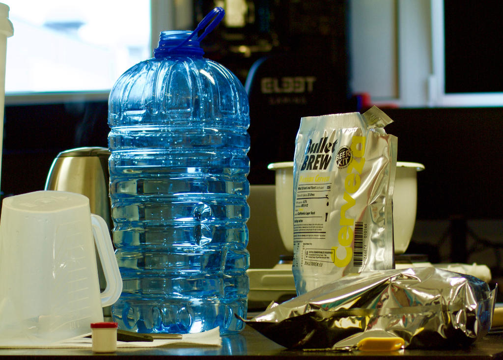
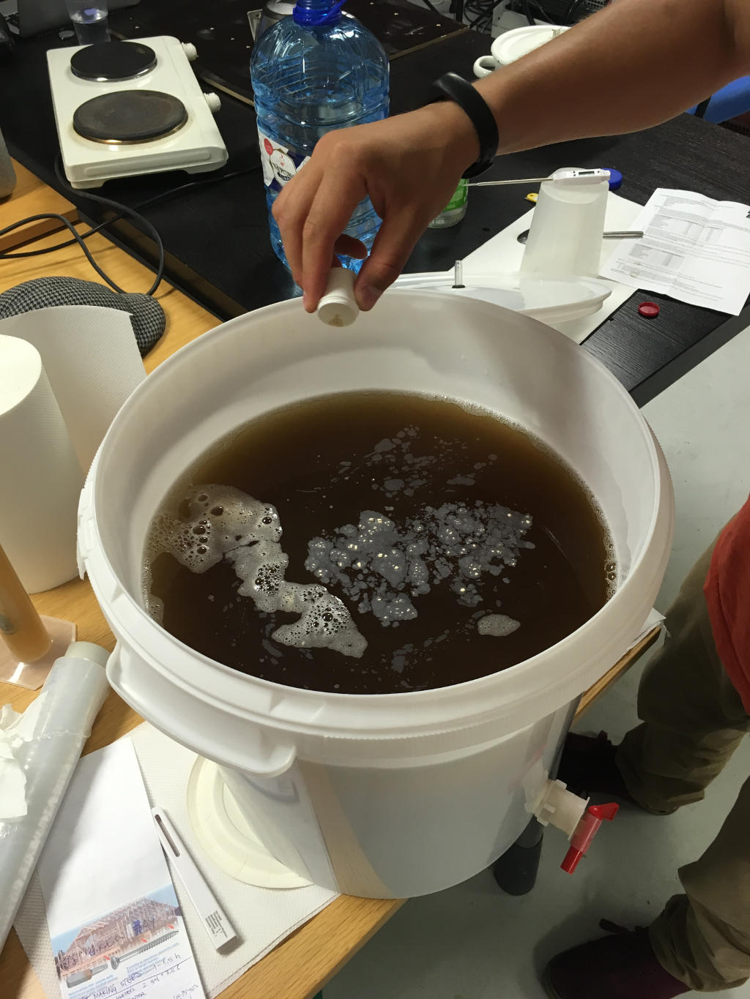
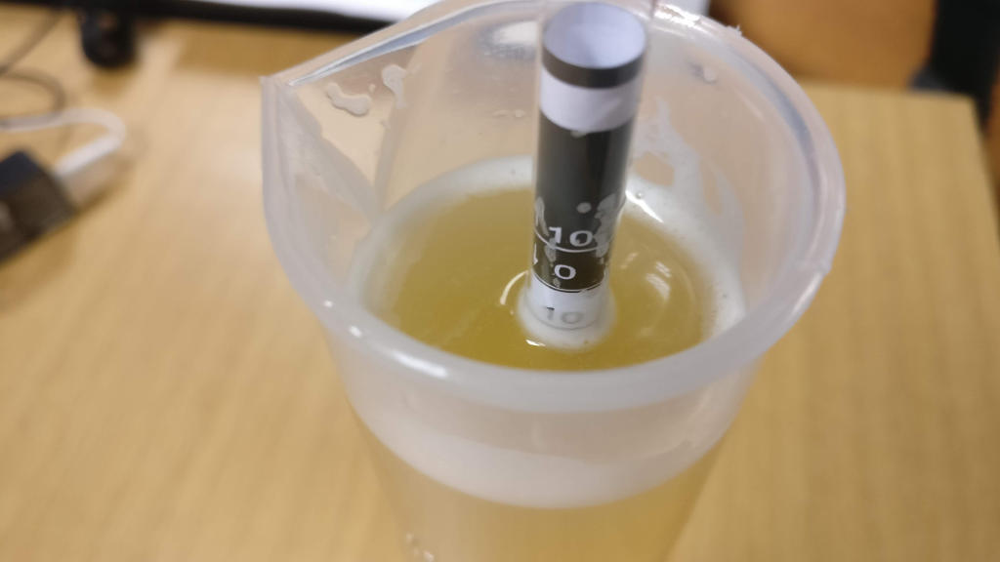

# Brewing beer @ k-space.ee - Batch 001

_2018-06-13_

Second batch of DIY-Bräu

### Idea (of this brew)
Summery Cerveza with raspberry

### Ingredients
* [Bullet Brew Cerveza](http://www.pruulmeistrid.ee/en/product/bullet-brew-mexican-cerveza) (1.8 kg)
* 1 kg of brewing sugar (dried light malt)
* American Ale Yeast (came in the BB bag)

_Image author [@janesmae](https://github.com/janesmae)_

| # | Oe | [P.Alc.](https://www.brewersfriend.com/abv-calculator/ "Potential alcohol if Final Gravity is 1.08") |   Date   | Days | Notes |
| - | :-: | :-: | :-: | :-: | :- |
| 0 | 40 | 4.2 | 2018-06-13 | 0 | Brew Day! Took 4 hours, need to plan ahead to limit to 2 h (including cleaning and sanitizing). This time added 0.25 g of servomycel as the beer from previous batch was still going. Hopefully this will helpyeast to finish the fermentation. Also need to look into water chemistry as tap water has a lot of calcium deposits in it. 

Adding Servomycel (yeast nutrient, made locally, lol)

 |
| 1 | 12 |  | 2018-06-18 | 5 | Beer has yellow color, small fizz and a lot of small bubbles that refuse to disperse. 

Most probably an incorrect gravity measurement

 |
| 2 | 12 | 3.68 | 2018-06-21 | 8 | Beer has a bread-y aftertaste. Bubbles disperse more easily.
