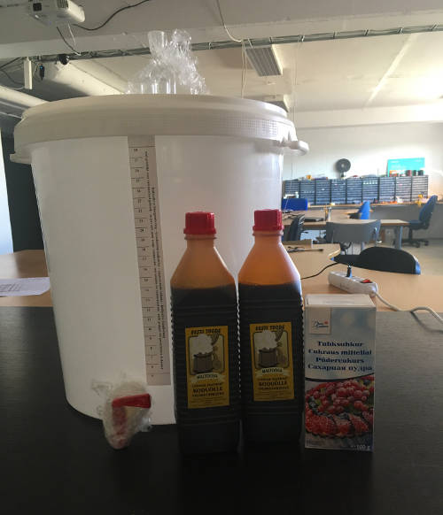

# Brewing beer @ k-space.ee

## 000

_12.05.2018_

The very beginning of making (somewhat) free beer at k-space

### Idea (of this brew)
To make beer out of the cheapest ingredients.

### Ingredients
* Malt extract from the supermarket (2*1.2kg)
* 0.5kg of powdered sugar (2% potato starch)
* Unknown yeast strain

Initial brewing setup and ingredients (yeast not pictured)

_Image author [@jaanjanesmae](https://github.com/janesmae)_

#### Measurements

| # | Oe |   SG  |  Bx  | [P.Alc.](https://www.brewersfriend.com/abv-calculator/ "Potential alcohol if Final Gravity is 1.019") |   Date   | Days | Notes |
| - | :-: | :---: | :--: | :----: | :------------------: | :-: | :---- |
| 0 | 38 | 1.038 |  9.5 |  4.95  | 12.05.18 | 0 |
| 1 | 12 | 1.012 |  3.07 |   "   | 17.05.18 | 5 |
| 2 | 12 | 1.012 |  3.07 |   "   | 19.05.18 | 7 | Brew is cloudy, taste has improved, slight bubbling on tongue. Will let clear for another 5 days. |
| 3 | 12 | 1.012 |  3.07 |   "   | 24.05.18 | 12 | Brew is less cloudy, taste has drastically improved (no yeast) but is watery. Reckon due to not putting enough malt. Time to bottle and start the second fermentation. Doesn't look too promising. |

