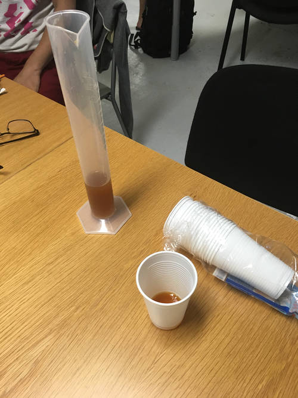
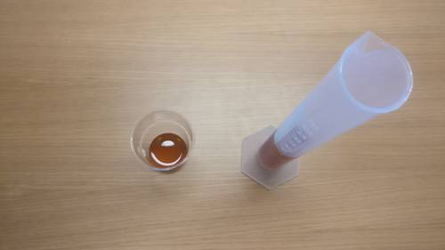
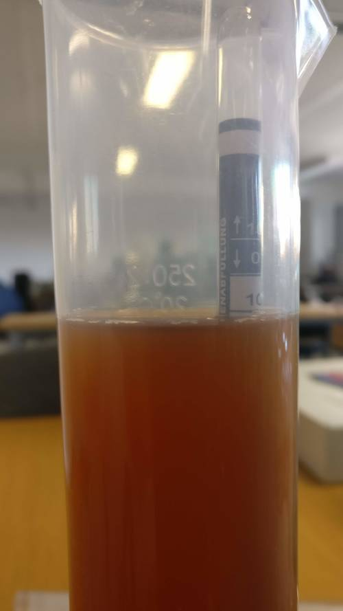
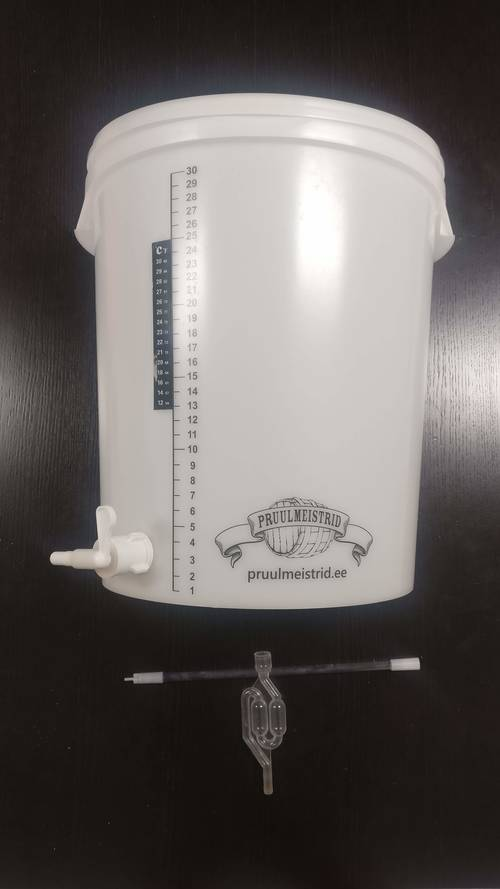

# Brewing beer @ k-space.ee

## 000

_12.05.2018_

The very beginning of making (somewhat) free beer at k-space

### Idea (of this brew)
To make beer out of the cheapest ingredients.

### Ingredients
* Malt extract from the supermarket (2*1.2kg)
* 0.5kg of powdered sugar (2% potato starch)
* Unknown yeast strain

Initial brewing setup and ingredients (yeast not pictured)

_Image author [@jaanjanesmae](https://github.com/janesmae)_

#### Measurements

| # | Oe |   SG  |  Bx  | [P.Alc.](https://www.brewersfriend.com/abv-calculator/ "Potential alcohol if Final Gravity is 1.019") |   Date   | Days | Notes |
| - | :-: | :---: | :--: | :----: | :------------------: | :-: | :---- |
| 0 | 38 | 1.038 |  9.5 |  4.95  | 2018-05-12 | 0 |
| 1 | 12 | 1.012 |  3.07 |   "   | 2018-05-17 | 5 | 

Click to view beer color

_Image author [@jaanjanesmae](https://github.com/janesmae)_

 |
| 2 | 12 | 1.012 |  3.07 |   "   | 2018-05-19 | 7 | Brew is cloudy, taste has improved, slight bubbling on tongue. Will let clear for another 5 days. |
| 3 | 12 | 1.012 |  3.07 |   "   | 2018-05-24 | 12 | Brew is less cloudy, taste has drastically improved (no yeast) but is watery. Reckon due to not putting enough malt. Time to bottle and start the second fermentation. Doesn't look too promising. 

Click to view beer color

 |
| 4 | 10 | 1.01 | 2.56 | 3.68 | 2018-05-26 | 14 | Bottling day. Brew had some clarity to it and smelled and tasted that has potential. Used 7g (coffee scoopful) of brown sugar per half a liter. Brew started bubbling a bit after adding sugar. For the other half of the beer added half a packet of concentrated cherry aroma which improved the smell drastically. Unfortunately due to light stirring, agitated yeast got into the bottles which will produce sediment. 

Click to view final measurement

 |

_2018-05-25_

In other news, got another tub to ferment in! 

Click to view

New ~30 litre fermentation bucket! Doubling Ballmer Peak production capacity!

